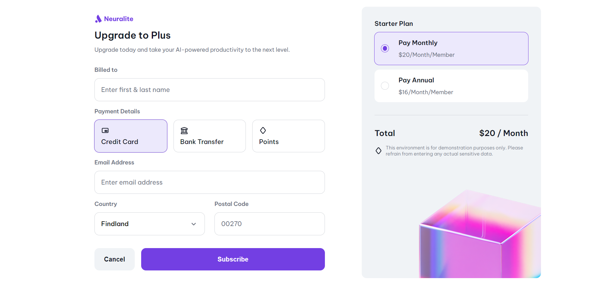

# Subscription Checkout

Este proyecto es una página web de proceso de suscripción, diseñada para ofrecer una selección de planes y opciones de pago en un entorno amigable y profesional. Se enfoca en una interfaz moderna, adaptable a diferentes tamaños de pantalla, con opciones claras de selección de planes y métodos de pago.

## Vista Previa



Puedes ver la versión demo en vivo aquí: [Subscription Checkout](https://ibrahim-003.github.io/Subscription-Checkout/)

## Características

- **Responsiva:** La página se adapta a diferentes tamaños de pantalla utilizando imágenes dinámicas con etiquetas `<picture>` y `srcset`.
- **Selección de planes:** Permite elegir entre diferentes planes de suscripción con opciones mensuales y anuales.
- **Opciones de pago:** Ofrece varios métodos de pago como tarjeta de crédito, transferencia bancaria, y puntos.
- **Formulario de suscripción:** Incluye un formulario completo para ingresar datos personales y detalles de pago.
- **Estilo moderno:** Usa la fuente "Be Vietnam Pro" desde Google Fonts para un estilo limpio y profesional.

## Estructura de Archivos

```
|-- index.html                # Página principal
|-- assets/
    |-- css/
    |   |-- reset.css         # Reseteo de estilos predeterminados del navegador
    |   |-- styles.css        # Estilos personalizados de la página
    |-- images/
    |   |-- card.svg          # Icono de tarjeta de crédito
    |   |-- bank.svg          # Icono de transferencia bancaria
    |   |-- Checkout-background.png       # Imagen de fondo para el checkout
    |   |-- neuralite-logo.svg # Logo de Neuralite
```

## Instalación

1. Clona este repositorio en tu máquina local:
   ```bash
   git clone https://github.com/Ibrahim-003/Subscription-Checkout.git
   ```
2. Asegúrate de tener conexión a Internet para cargar las fuentes de Google Fonts y los estilos CSS.
3. Abre `index.html` en tu navegador para ver la página.

## Uso

Puedes personalizar esta página modificando los estilos en el archivo `styles.css` o ajustando el contenido en `index.html`. Cambia los planes de suscripción, ajusta las imágenes o añade nuevos métodos de pago según sea necesario.

## Tecnologías Utilizadas

- HTML5
- CSS3
- Google Fonts

## Autor

Este proyecto fue creado por [Ibrahim Almeyda].
